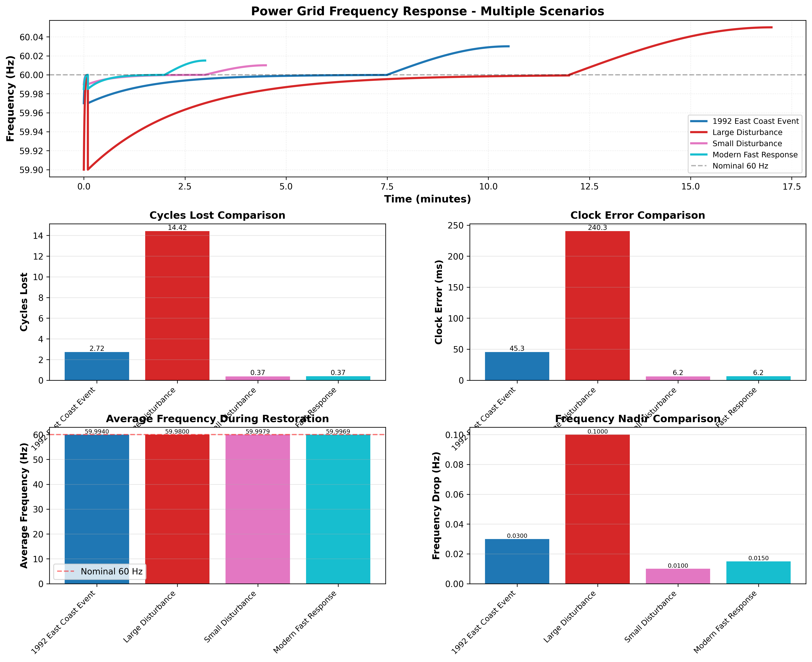

# Power Grid Frequency Simulator

A comprehensive Python-based interactive simulator for analyzing power grid frequency dynamics, based on the historical November 12, 1992 East Coast power grid event.



## 📋 Overview

This project provides both interactive GUI applications and command-line tools to simulate, analyze, and visualize power grid frequency responses to generation loss events. It's designed for educational purposes, engineering analysis, and understanding power system dynamics.

## 🎯 The Problem

**Historical Event: November 12, 1992, 10:09 AM**

A large generator on the East Coast tripped out, causing:
- Loss of 1,050 MW from an 18,823 MW interconnected power pool
- Frequency drop from 60 Hz to 59.97 Hz in seconds
- 7.5-minute restoration period back to 60 Hz
- Overshoot correction phase to recover lost cycles and fix electric clocks

**Questions Answered:**
- a. What was the average frequency during restoration?
- b. How many cycles were generated during restoration?
- c. How many cycles would have been generated at 60 Hz?
- d. How much did electric clocks fall behind, and by how much?

**Calculated Answers (1992 Event):**
- a. Average Frequency: **59.994 Hz**
- b. Cycles Generated: **26,997.28 cycles**
- c. Cycles @ 60 Hz: **27,000 cycles**
- d. Clock Error: **45.27 milliseconds** (clock ran slow)

## 🚀 Quick Start

### Installation

```bash
# Clone or download this repository
# Install dependencies
pip install -r requirements.txt

# Or manually
pip install numpy matplotlib
```

### Running the Applications

```bash
# Interactive GUI - Basic Version (recommended for learning)
python power_grid_frequency_simulator.py

# Interactive GUI - Advanced Version (for detailed analysis)
python power_grid_simulator_advanced.py

# Command-line demonstration (no GUI required)
python demo_calculations.py
```

## 📁 Project Files

### Main Applications

| File | Description | Best For |
|------|-------------|----------|
| `power_grid_frequency_simulator.py` | Basic interactive simulator with 5 visualizations | Learning, basic scenarios |
| `power_grid_simulator_advanced.py` | Advanced simulator with tabs, presets, comparisons | Detailed analysis, research |
| `demo_calculations.py` | Command-line calculator and plot generator | Quick calculations, batch processing |

### Documentation

| File | Content |
|------|---------|
| `README.md` | This file - project overview |
| `SOLUTIONS.md` | Complete mathematical solutions with derivations |
| `README_POWER_GRID.md` | Comprehensive technical documentation |
| `QUICKSTART.md` | Detailed usage guide and tutorials |
| `requirements.txt` | Python dependencies |

## 🎨 Features

### Basic Simulator Features
- ✅ 8 adjustable parameters via sliders
- ✅ Real-time frequency response simulation
- ✅ 5 comprehensive visualizations
- ✅ Instant result calculations
- ✅ Clean, intuitive interface

### Advanced Simulator Features
- ✅ All basic features plus:
- ✅ 6 preset scenarios (1992 event, large/small disturbances, weak grid, modern response, critical event)
- ✅ Scenario comparison (side-by-side analysis)
- ✅ Detailed analysis report generation
- ✅ Export capabilities (CSV data, PNG/PDF/SVG plots, text reports)
- ✅ Multi-tab interface (Simulator, Comparison, Analysis)
- ✅ Quick compare all presets feature

### Demo Script Features
- ✅ No GUI required
- ✅ Multiple scenario analysis
- ✅ Automated plot generation
- ✅ Detailed console output
- ✅ Perfect for batch processing

## 📊 Visualizations

Both simulators provide comprehensive visualizations:

1. **Frequency Response** - Main frequency trajectory over time
2. **Cumulative Cycles** - Actual vs ideal cycle accumulation
3. **Cycle Deficit** - Lost cycles visualization
4. **Frequency Deviation** - Deviation from nominal 60 Hz
5. **Clock Error** - Electric clock error accumulation

The advanced simulator adds:
- **Frequency Comparison** - Multiple scenarios overlaid
- **Cycles Lost Comparison** - Bar chart comparison
- **Clock Error Comparison** - Bar chart comparison

## 🎓 Educational Use

This simulator is perfect for teaching:

### Power Systems Engineering
- Frequency response to disturbances
- Governor action and automatic generation control (AGC)
- Spinning reserves and system inertia
- Load-frequency control
- Under-frequency load shedding (UFLS)

### Control Systems
- System dynamics and exponential responses
- Time constants and steady-state behavior
- Feedback control systems
- Disturbance rejection

### Real-World Applications
- Grid stability analysis
- Renewable energy integration challenges
- Battery storage for frequency response
- HVDC interconnection benefits

## 🔬 Technical Details

### Simulation Model

The frequency response is modeled using exponential dynamics:

**Drop Phase (rapid):**
```
f(t) = f_min + (f_0 - f_min) × (1 - e^(-t/τ_drop))
```

**Restoration Phase:**
```
f(t) = f_min + (f_0 - f_min) × (1 - e^(-t/τ_restore))
```

**Overshoot Phase:**
```
f(t) = f_0 + (f_overshoot - f_0) × sin(πt/(2T_overshoot))
```

### Key Calculations

**Average Frequency:**
```
f_avg = (1/T) × ∫[0 to T] f(t) dt
```

**Cycles Generated:**
```
N_cycles = ∫[0 to T] f(t) dt × 60 seconds/minute
```

**Clock Error:**
```
Error = (T × 60 - N_cycles / 60) seconds
```

## 📖 Usage Examples

### Example 1: Replicate 1992 Event
```bash
python demo_calculations.py
# See detailed output and generated plots
```

### Example 2: Explore Different Scenarios
```bash
python power_grid_simulator_advanced.py
# Click "Quick Compare All Presets"
# Switch to "Comparison" tab
# Observe differences between scenarios
```

### Example 3: Custom Analysis
```bash
python power_grid_frequency_simulator.py
# Adjust sliders:
#   - Total Power: 20000 MW
#   - Lost Power: 1500 MW
#   - Restoration Time: 5 minutes
# Click "Update Simulation"
# Observe results
```

## 🎮 Preset Scenarios

The advanced simulator includes 6 preset scenarios:

1. **1992 East Coast Event** - Historical event (default)
2. **Large Disturbance** - 2,500 MW loss, severe frequency drop
3. **Small Disturbance** - 300 MW loss, minimal impact
4. **Weak Grid** - Smaller system, same loss, bigger impact
5. **Modern Fast Response** - Contemporary grid with fast governor response
6. **Critical Under-frequency** - Approaching load shedding threshold

## 📈 Sample Results

### 1992 East Coast Event
- Power Loss: 1,050 MW (5.58%)
- Frequency Drop: 0.03 Hz
- Average Frequency: 59.994 Hz
- Cycles Lost: 2.72 cycles
- Clock Error: 45.27 ms

### Large Disturbance
- Power Loss: 2,500 MW (13.28%)
- Frequency Drop: 0.10 Hz
- Average Frequency: 59.980 Hz
- Cycles Lost: 14.42 cycles
- Clock Error: 240.30 ms

### Modern Fast Response
- Power Loss: 1,050 MW (4.20%)
- Frequency Drop: 0.015 Hz
- Average Frequency: 59.997 Hz
- Cycles Lost: 0.37 cycles
- Clock Error: 6.25 ms

## 🔍 Physical Interpretation

### Why Frequency Drops
1. Generation suddenly less than load
2. System draws on kinetic energy of rotating machines
3. Rotors slow down → frequency decreases
4. Governors respond → increase generation
5. Frequency gradually restored

### Why Clock Error Matters
- Electric clocks count AC cycles to measure time
- Lost cycles = clock runs slow
- Overshoot correction recovers lost cycles
- Historically important for synchronized systems

### Critical Thresholds
- **59.5 Hz** - Under-frequency load shedding begins
- **59.3 Hz** - Additional load shedding
- **58.8 Hz** - Major load shedding
- **Below 58 Hz** - Risk of system collapse

## 💾 Export Capabilities

The advanced simulator allows exporting:

### Data Export (CSV)
- Time series data
- Frequency values
- Cumulative cycles
- Clock error

### Plot Export
- PNG (high resolution)
- PDF (vector graphics)
- SVG (scalable)

### Report Export
- Detailed text analysis
- System assessment
- Recommendations

## 🛠️ Customization

### Adjustable Parameters

All simulators allow adjusting:
- Total system power (MW)
- Lost generation (MW)
- Initial frequency (Hz)
- Minimum frequency (Hz)
- Restoration time (minutes)
- Recovery time (minutes)
- Overshoot frequency (Hz)
- Overshoot duration (minutes)

### Scenario Creation

Create custom scenarios by:
1. Adjusting sliders
2. Observing results
3. Adding to comparison (advanced)
4. Exporting data/plots

## 📚 Documentation Structure

```
README.md                              ← You are here (overview)
├── QUICKSTART.md                      ← Detailed usage guide
├── SOLUTIONS.md                       ← Mathematical solutions
├── README_POWER_GRID.md              ← Technical documentation
└── requirements.txt                   ← Dependencies
```

## 🎯 Learning Path

1. **Start Here**: Read this README
2. **Run Demo**: `python demo_calculations.py`
3. **Try Basic GUI**: `python power_grid_frequency_simulator.py`
4. **Read Solutions**: Open `SOLUTIONS.md`
5. **Deep Dive**: Use advanced simulator
6. **Technical Details**: Read `README_POWER_GRID.md`
7. **Master It**: Read `QUICKSTART.md` for tips and tricks

## 🌐 Real-World Events

This simulator helps understand events like:
- **Texas 2021** - Frequency collapse during winter storm
- **Europe 2006** - Frequency drop from line trip
- **Australia 2016** - South Australia blackout
- **Northeast 2003** - Blackout propagation

## 🤝 Use Cases

### For Students
- Learn power system dynamics
- Understand frequency control
- Visualize complex concepts
- Prepare for exams/projects

### For Engineers
- Quick analysis of disturbances
- "What-if" scenario exploration
- Training and demonstrations
- Report generation

### For Researchers
- Baseline for advanced models
- Educational tool development
- Publication graphics
- Data generation

## ⚡ Performance

- Simulations run in milliseconds
- Smooth interactive response
- Handles multiple scenarios simultaneously
- High-resolution plot generation

## 🐛 Troubleshooting

**Issue**: Dependencies missing
```bash
pip install numpy matplotlib
```

**Issue**: GUI won't start
- Check if tkinter is installed (usually comes with Python)
- Try demo script instead: `python demo_calculations.py`

**Issue**: Strange results
- Verify parameter ranges are logical
- Reset to defaults and try again
- Check that min_freq < initial_freq

## 📄 License

This project is provided for educational purposes. Feel free to use, modify, and distribute.

## 🙏 Acknowledgments

Based on the historical November 12, 1992 power grid event, documented in electrical engineering textbooks as a classic example of grid frequency response and stability.

## 📮 Contact & Contribution

This is an educational project. Feel free to:
- Extend the models
- Add new scenarios
- Improve visualizations
- Create additional analysis tools

## 🎓 Further Reading

- NERC Frequency Response Standards
- IEEE Power System Dynamics and Stability
- Power System Analysis (Grainger & Stevenson)
- Modern Power System Analysis (Kothari & Nagrath)

---

**Ready to explore power grid dynamics?**

```bash
python power_grid_frequency_simulator.py
```

**Happy simulating! ⚡**
